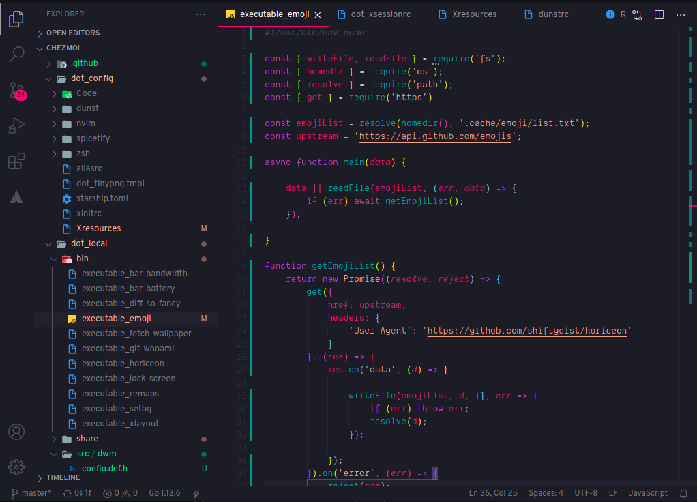

[](https://github.com/shiftgeist/horiceon/issues) [](https://github.com/shiftgeist/horiceon/stargazers)

```markdown
Dark 🌆 themed 🎨 rice 🍚.
```

<!-- START doctoc generated TOC please keep comment here to allow auto update -->
<!-- DON'T EDIT THIS SECTION, INSTEAD RE-RUN doctoc TO UPDATE -->
**Table of content**

- [About](#about)
- [Screenshots](#screenshots)
- [Shortcuts](#shortcuts)
- [Installation](#installation)

<!-- END doctoc generated TOC please keep comment here to allow auto update -->

## About

Horiceon includs [dwm](https://github.com/shiftgeist/horiceon/tree/master/dot_local/src/dwm), xterm, [neovim config](https://github.com/shiftgeist/horiceon/blob/master/dot_config/nvim/init.vim) dvtm, dmenu, [dunst](https://github.com/shiftgeist/horiceon/blob/master/dot_config/dunst/dunstrc), [custom zsh config](https://github.com/shiftgeist/horiceon/blob/master/dot_config/zsh/dot_zshrc) with [starship](https://starship.rs/), [code theme](https://github.com/shiftgeist/horiceon/tree/master/dot_vscode/extensions/horiceon-theme), [spotify theme](https://github.com/shiftgeist/horiceon/tree/master/dot_config/spicetify/Themes/Horiceon), [Overpass font](http://overpassfont.org), [Dank Mono font](https://dank.sh) and [diff-so-fancy](https://github.com/so-fancy/diff-so-fancy).

Managed with [chezmoi](https://github.com/twpayne/chezmoi) and inspired by [Horizon Theme](https://marketplace.visualstudio.com/items?itemName=jolaleye.horizon-theme-vscode) made by [@jolaleye](https://github.com/jolaleye).

## Screenshots

**Code**


**Spotify Theme**


## Shortcuts

| Binding                 | Description               | Exec        |
| ----------------------- | ------------------------- | ----------- |
| `Caps`                  | Switched with `Esc`       | -           |
| `Esc`                   | Switched with `Caps`      | -           |
| `Print`                 | Screenshot                | `flameshot` |
| `Super + Ctrl + Space`  | Open emoji picker         | -           |
| `Super + E`             | Open files manager        | `nautilus`  |
| `Super + Number`        | Switch to tag number      | -           |
| `Super + P`             | Open Application Launcher | `dmenu`     |
| `Super + Q`             | Close Application         | -           |
| `Super + Return`        | Launch Terminal           | `xterm`     |
| `Super + S`             | Lock screen               | TBD         |

```
xkb-options ['lv3:ralt_switch', 'eurosign:e', 'caps:swapescape']
```

## Installation

```bash
pacman -S base-devil git chezmoi

git clone https://aur.archlinux.org/yay.git
cd yay
makepkg -si

chezmoi init git@github.com:shiftgeist/horiceon.git
```
