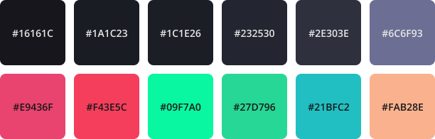

# Horiceon

Dark themed rice

## What modules are included?

| Software             | What i use                                                   | dotfiles                                                     |
| -------------------- | ------------------------------------------------------------ | ------------------------------------------------------------ |
| Editor               | [code](https://github.com/microsoft/vscode)                  | [`.config/Code/User/`](.config/Code/User)                    |
| Launcher             | [rofi](https://github.com/davatorium/rofi)                   | [`.config/rofi/`](.config/rofi)                              |
| Notification Daemon  | [dunst](https://github.com/dunst-project/dunst)              | [`.config/dunst/`](.config/dunst/) |
| Shell prompt         | [zsh](https://zsh.org) with [ohmyzsh](https://github.com/ohmyzsh/ohmyzsh) - [spaceship](https://github.com/denysdovhan/spaceship-prompt) | [`.zshrc`](.zshrc)                                           |
| Status bar           | [polybar](https://github.com/polybar/polybar)                | [`.config/polybar/`](.config/polybar/)                       |
| Terminal Emulator    | [kitty](https://sw.kovidgoyal.net/kitty)                     | [`.config/kitty/`](.config/kitty)                            |
| Node Version Manager | [nvm](https://github.com/nvm-sh/nvm)                         | [`.nvm/`](.nvm)                                              |
| Customized Spotify   | [spicetify](https://github.com/khanhas/spicetify-cli)        | [`.config/spicetify/Themes/Horiceon/`](.config/spicetify/Themes/Horiceon) |
| AUR Helper           | [yay](https://github.com/Jguer/yay)                          | [`aur/yay`](aur/yay)                                         |
| X11 Compositor       | [compton](https://github.com/chjj/compton/)                  | -                                                            |

## Colors

**Syntax**

**UI**

## Installation

    sudo pacman -Syu base-devel git

    cd aur/yay && makepkg -si

    # core packages of horiceon
    ./helper/packages.sh

    # symlink or copy packages into your home directory

## AUR

    
AUR packages that i use

    | Software         | What i use                                        | AUR Nam         |
    | ---------------- | ------------------------------------------------- | --------------- |
    | WYSIWYG Editor   | [Typora](https://typora.io/)                      | `typora`        |
    | Browser          | [Brave](https://brave.com/)                       | `brave-bin`     |
    | Music Client     | [Spotify](https://www.spotify.com/)               | `spotify`       |
    | Password Manager | [Bitwarden](https://github.com/bitwarden/desktop) | `bitwarden-bin` |
    | Notes            | [Notion](https://www.notion.so/)                  | `notion-app`    |

    yay -S typora brave-bin spotify bitwarden-bin notion-app

## Future plans

- Polybar (twitter notification, volume)
- Add shutdown, reboot, etc panel/menu
- Add $mod+d for `i3lock`

## Resources

- [i3wm: Jump Start](https://www.youtube.com/watch?v=j1I63wGcvU4)
