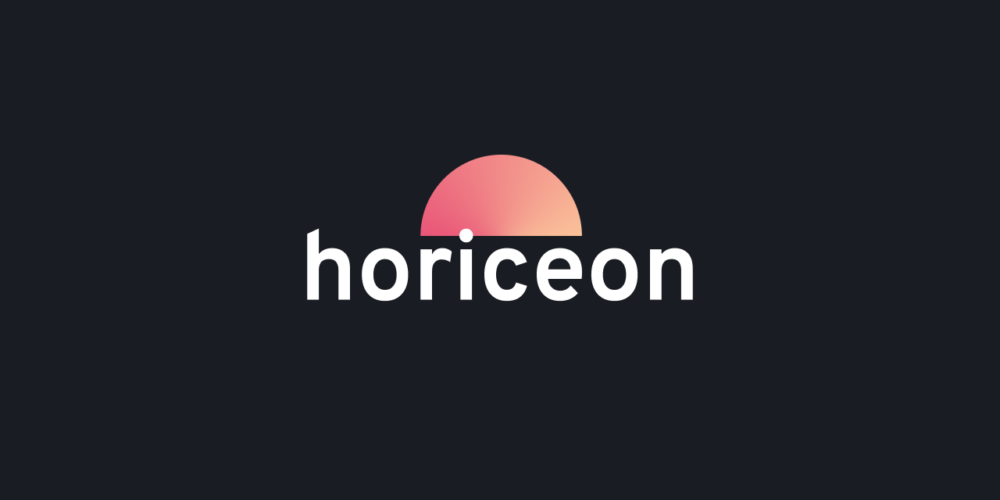
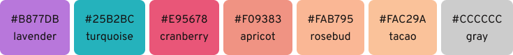
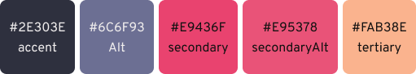
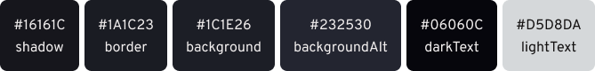
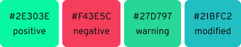
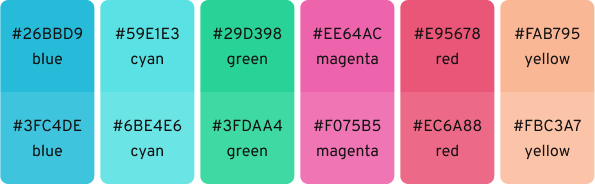

# Horiceon

> [Managed](https://github.com/twpayne/chezmoi) dark 🌆 themed 🎨 rice 🍚.

<!-- START doctoc generated TOC please keep comment here to allow auto update -->
<!-- DON'T EDIT THIS SECTION, INSTEAD RE-RUN doctoc TO UPDATE -->

**TOC**

- [What's included?](#whats-included)
- [Theme](#theme)
- [Installation](#installation)
- [About](#about)

<!-- END doctoc generated TOC please keep comment here to allow auto update -->

## Theme

**Typography**

- Monospace: [Dank Mono](https://dank.sh/)
- Sans: [Overpass](http://overpassfont.org/)

**Syntax Colors**



**UI Colors**



<details>
  <summary>More</summary>





**ANSI**



</details>

<details>
  <summary>Shortcuts Concept</summary>

| Binding                 | Description               | Function                       |
| ----------------------- | ------------------------- | ------------------------------ |
| `Super + CTRL + S`      | Lock screen               | `i3lock`                       |
| `Super + E`             | Open files manager        | `nautilus`                     |
| `Super + Q`             | Close Application         | -                              |
| `Super + Return`        | Launch Terminal           | `lxterminal -e "dvtm"` or `st` |
| `Super + Space`         | Open Application Launcher | `dmenu` or `rofi`              |
| `Super + Number`        | Switch to tag number      | -                              |

</details>

## Installation

**Required** on Arch: `base-devil` `git` `chezmoi`

```bash
chezmoi init git@github.com:shiftgeist/horiceon.git

cd ~/.local/share/chezmoi

git submodule update --init

chezmoi apply
```

## Goals

- [ ] Replace `oh-my-zsh` with vanilla zsh.

## About

This is more a concept to build ontop of the suckless philosophy than a finished product.

**Inspiration**

This project is inspired by the vscode [Horizon Theme](https://marketp\lace.visualstudio.com/items?itemName=jolaleye.horizon-theme-vscode) by [@jolaleye](https://github.com/jolaleye).

**Statistics**

 [](https://github.com/shiftgeist/horiceon/issues) [](https://github.com/shiftgeist/horiceon/stargazers)

**License**


