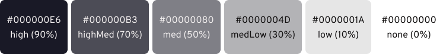

# Horiceon

> Dark 🌆 themed 🎨 rice 🍚.

<!-- START doctoc generated TOC please keep comment here to allow auto update -->
<!-- DON'T EDIT THIS SECTION, INSTEAD RE-RUN doctoc TO UPDATE -->
**Table of Contents**

- [What modules are included?](#what-modules-are-included)
- [Colors](#colors)
- [Installation](#installation)
- [AUR](#aur)
- [Future plans](#future-plans)
- [About](#about)
  - [Inspiration](#inspiration)
  - [Statistics](#statistics)

<!-- END doctoc generated TOC please keep comment here to allow auto update -->

## What modules are included?

| Software             | What i use                                                   | dotfiles                                                     |
| -------------------- | ------------------------------------------------------------ | ------------------------------------------------------------ |
| Editor               | [code](https://github.com/microsoft/vscode)                  | [`.config/Code/User/`](.config/Code/User)                    |
| Launcher             | [rofi](https://github.com/davatorium/rofi)                   | [`.config/rofi/`](.config/rofi)                              |
| Notification Daemon  | [dunst](https://github.com/dunst-project/dunst)              | [`.config/dunst/`](.config/dunst/) |
| Shell prompt         | [zsh](https://zsh.org) with [ohmyzsh](https://github.com/ohmyzsh/ohmyzsh) - [spaceship](https://github.com/denysdovhan/spaceship-prompt) | [`.zshrc`](.zshrc)                                           |
| Status bar           | [polybar](https://github.com/polybar/polybar)                | [`.config/polybar/`](.config/polybar/)                       |
| Terminal Emulator    | [kitty](https://sw.kovidgoyal.net/kitty)                     | [`.config/kitty/`](.config/kitty)                            |
| Node Version Manager | [nvm](https://github.com/nvm-sh/nvm)                         | [`.nvm/`](.nvm)                                              |
| Customized Spotify   | [spicetify](https://github.com/khanhas/spicetify-cli)        | [`.config/spicetify/Themes/Horiceon/`](.config/spicetify/Themes/Horiceon) |
| AUR Helper           | [yay](https://github.com/Jguer/yay)                          | [`aur/yay`](aur/yay)                                         |
| X11 Compositor       | [compton](https://github.com/chjj/compton/)                  | -                                                            |

## Colors

**Syntax**


**UI**


**ANSI**


**Alpha Variations**



## Installation

```bash
sudo pacman -Syu base-devel git

cd aur/yay && makepkg -si

# core packages of horiceon
./helper/packages.sh

# symlink or copy packages into your home directory
```

## AUR

<details>
    <summary>AUR packages that i use</summary>

    | Software         | What i use                                             | AUR Nam         |
    | ---------------- | ------------------------------------------------------ | --------------- |
    | Browser          | [Brave](https://brave.com/)                            | `brave-bin`     |
    | Music Client     | [Spotify](https://www.spotify.com/)                    | `spotify`       |
    | Notes            | [Notion](https://www.notion.so/)                       | `notion-app`    |
    | Password Manager | [Bitwarden](https://github.com/bitwarden/desktop)      | `bitwarden-bin` |
    | Screenshot       | [Flameshot](https://github.com/lupoDharkael/flameshot) | `flameshot`     |
    | WYSIWYG Editor   | [Typora](https://typora.io/)                           | `typora`        |

</details>

```bash
yay -S typora brave-bin spotify bitwarden-bin notion-app
```

## Future plans

This project is still in its early phase.

* [ ] Only show finished tools in [`What modules are included?`](#what-modules-are-included)
* [ ] Update kitty theme with defined colors
* [ ] Add license
* [ ] Polybar (twitter notification, volume)
* [ ] Add shutdown, reboot, etc panel/menu
* [ ] Add $mod+d for `i3lock`
* [ ] Add battery display
* [ ] Check if offline before executing gmail
* [ ] Add polybar network module

## About

### Inspiration

This project is inspired by the vscode [Horizon Theme](https://marketplace.visualstudio.com/items?itemName=jolaleye.horizon-theme-vscode) by [@jolaleye](https://github.com/jolaleye).

### Statistics

 [](https://github.com/shiftgeist/horiceon/issues) [](https://github.com/shiftgeist/horiceon/stargazers)
