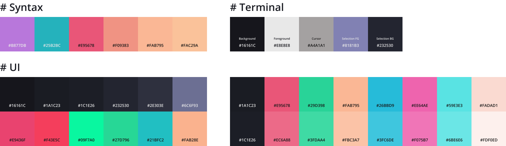

# Horiceon

Dark themed rice

## What modules are included?

| Software             | What i use                                                   | dotfile                             |
| -------------------- | ------------------------------------------------------------ | ----------------------------------- |
| Editor               | [vscode](https://github.com/microsoft/vscode)                | `.config/Code/User/`                |
| Launcher             | [rofi](https://github.com/davatorium/rofi)                   | `.config/rofi/`                     |
| Notification Daemon  | [dunst](https://github.com/dunst-project/dunst)              |                                     |
| Shell prompt         | [zsh](https://zsh.org) with [ohmyzsh](https://github.com/ohmyzsh/ohmyzsh) - [spaceship](https://github.com/denysdovhan/spaceship-prompt) | `.zshrc`                            |
| Status bar           | [polybar](https://github.com/polybar/polybar)                |                                     |
| Terminal Emulator    | [kitty](https://sw.kovidgoyal.net/kitty)                     | `.config/kitty/`                    |
| Node Version Manager | [nvm](https://github.com/nvm-sh/nvm)                         | `.nvm/`                             |
| Customised Spotify   | [spicetify](https://github.com/khanhas/spicetify-cli)        | `.config/spicetify/Themes/Horiceon` |

## Colors

