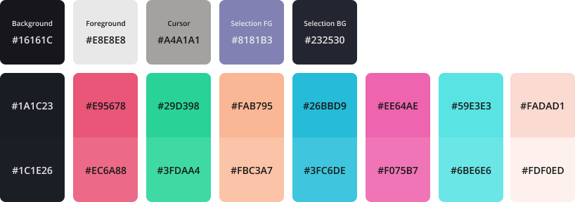

# Horiceon

Dark themed rice

## What modules are included?

| Software             | What i use                                                   | dotfiles                                                     |
| -------------------- | ------------------------------------------------------------ | ------------------------------------------------------------ |
| Editor               | [vscode](https://github.com/microsoft/vscode)                | [`.config/Code/User/`](.config/Code/User)                    |
| Launcher             | [rofi](https://github.com/davatorium/rofi)                   | [`.config/rofi/`](.config/rofi)                              |
| Notification Daemon  | [dunst](https://github.com/dunst-project/dunst)              |                                                              |
| Shell prompt         | [zsh](https://zsh.org) with [ohmyzsh](https://github.com/ohmyzsh/ohmyzsh) - [spaceship](https://github.com/denysdovhan/spaceship-prompt) | [`.zshrc`](.zshrc)                                           |
| Status bar           | [polybar](https://github.com/polybar/polybar)                |                                                              |
| Terminal Emulator    | [kitty](https://sw.kovidgoyal.net/kitty)                     | [`.config/kitty/`](.config/kitty)                            |
| Node Version Manager | [nvm](https://github.com/nvm-sh/nvm)                         | [`.nvm/`](.nvm)                                              |
| Customized Spotify   | [spicetify](https://github.com/khanhas/spicetify-cli)        | [`.config/spicetify/Themes/Horiceon/`](.config/spicetify/Themes/Horiceon) |
| AUR Helper           | [yay](https://github.com/Jguer/yay)                          | [`aur/yay`](aur/yay)                                         |

## Colors

**Syntax**

**UI**

**Terminal**

## AUR

| Software       | What i use                                     | Command                |
| -------------- | ---------------------------------------------- | ---------------------- |
| WYSIWYG Editor | [Typora](https://typora.io/)                   | `yay -S typora`        |
| Browser        | [Google Chrome](https://www.google.com/chrome) | `yay -S google-chrome` |
| Music Client   | [Spotify](https://www.spotify.com/)            | `yay -S spotify`       |

